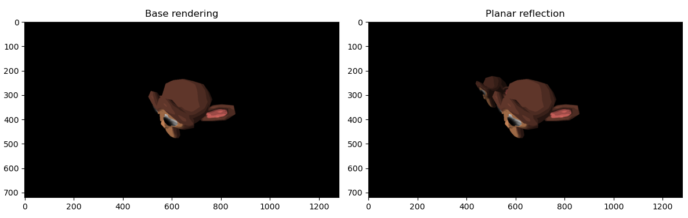
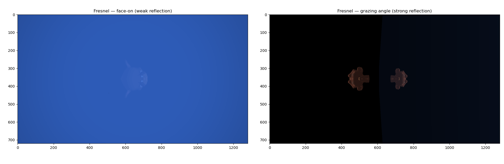
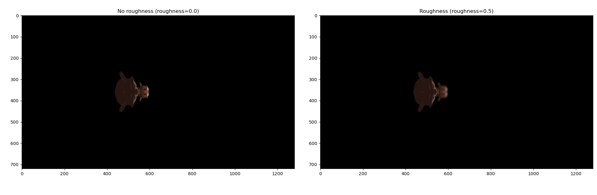
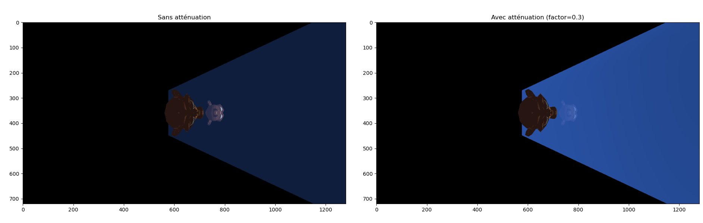

# Planar Reflection — Software 3D Rendering Pipeline

Realistic mirror reflections implemented from scratch in a **software rasterizer written in Python** (NumPy only, no OpenGL): virtual camera, clipping plane, and physically inspired effects (Fresnel, attenuation, roughness).

> 3D graphics course project — Master MoSIG (Université Grenoble Alpes), April 2026.
> Made by **Alexandre Gauchier** and Elouann Marfil.
> 🖼️ [Project poster (PDF)](Poster.pdf)



---

## What is planar reflection?

Planar reflection simulates the reflection of a scene on a flat surface (mirror, polished floor, calm water). The scene is rendered a second time from a **virtual camera**, symmetric to the real camera with respect to the mirror plane, and this render is then projected onto the reflective surface.

## What we implemented

The project builds on the software rendering pipeline developed during the course labs:

- **Vertex shader**: view and projection transforms, normal, light and view vectors.
- **Rasterizer**: bounding box, barycentric coordinates, attribute interpolation, depth buffer.
- **Fragment shader**: Phong lighting (ambient, diffuse, specular), texture sampling, toon shading.

On top of it, we added planar reflection:

- **Virtual camera**: mirror of the real camera with respect to the mirror plane, with one full extra render per mirror.
- **Clipping plane**: discards the fragments located on the wrong side of the mirror during the virtual render.
- **Stencil buffer**: marks the pixels covered by the mirror surface.
- **Two sampling modes**: `screen` reads the reflection buffer at the same screen position (fast approximation, used for the poster), `reproject` projects each mirror fragment through the virtual camera (more precise, experimental).
- **Three mirror configurations**: horizontal floor, vertical wall, and a 45° tilted surface.

And three physically inspired effects:

| Fresnel | Roughness | Attenuation |
|---|---|---|
|  |  |  |
| Reflection gets stronger at grazing angles (Schlick-style approximation) | The reflection buffer is blurred to simulate a rough surface | The reflection weakens with distance |

---

## Limitations

- Only works on **flat surfaces**: no reflections on curved objects.
- **One full extra render per mirror**, which is costly in a pure Python rasterizer (about 10 s per frame at 1280×720).
- **Screen-space sampling is an approximation**, with a slight offset on highly inclined surfaces. The `reproject` mode addresses this, but its correctness was not fully validated, so it was not used for the final renders.
- The reflection is only visible where the mirror surface is rasterized.

**Possible improvements**: oblique projection to remove clipping artifacts near the mirror plane, validated per-fragment reprojection, screen-space reflections (SSR) for any surface, and environment maps for non-flat objects.

---

## How to run

```bash
git clone https://github.com/AlexandreGhr/planar-reflection-renderer.git
cd planar-reflection-renderer
python3 -m venv .venv
source .venv/bin/activate
pip install -r requirements.txt

python3 main.py         # final render with planar reflection
python3 comparatif.py   # side-by-side comparisons
```

All parameters are in [`config.py`](config.py):

| Parameter | Values | Description |
|---|---|---|
| `CAM_MODE` | `0` to `3` | Predefined camera positions |
| `ACTIVE_MIRRORS` | `['floor']`, `['wall']`, `['tilted']` or combinations | Active mirrors in the scene |
| `MIRROR_MODE` | `'perfect'` / `'surface'` | `perfect` = 100% reflective, `surface` = partial reflection (enables Fresnel and attenuation) |
| `MIRROR_ROUGHNESS` | `0.0` to `1.0` | `0.0` = sharp reflection, `1.0` = very blurry |
| `REFLECTION_SAMPLING` | `'screen'` / `'reproject'` | Reflection sampling mode |
| `FRESNEL_ENABLED` | `True` / `False` | Fresnel effect |
| `ATTENUATION_ENABLED` | `True` / `False` | Distance attenuation |
| `ATTENUATION_FACTOR` | float | Attenuation intensity |
| `POST_PROCESSING` | `True` / `False` | Fills the pixels outside the mirror with a blend of the floor reflection and a base color (floor only) |
| `COMPARISON_MODE` | `0` to `4` | Comparison shown by `comparatif.py`: base vs reflection, Fresnel, camera offset, roughness, attenuation |

---

## Project structure

```
├── main.py             # Main entry point
├── comparatif.py       # Visual comparisons
├── config.py           # All parameters
├── graphicPipeline.py  # Vertex shader, rasterizer, fragment shaders, reflection effects
├── camera.py           # Camera and view matrix
├── projection.py       # Projection matrix
├── reflection.py       # Virtual camera (mirror symmetry)
├── scene.py            # Mirror surfaces (floor, wall, tilted)
├── readply.py          # .ply mesh loader
├── suzanne.ply         # 3D mesh
├── suzanne.png         # Texture
├── images/             # Renders used in the poster
└── Poster.pdf / .png   # Project poster
```

## References

- E. Lengyel, *Oblique View Frustum Depth Projection and Clipping*, Journal of Game Development, 2005.
- Unity Technologies, *Screen Space Reflection*, Unity Manual.